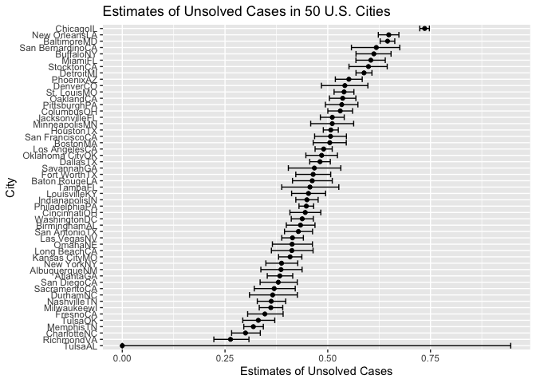

p8105_hw5_st3431
================
2022-11-16

## R Markdown

``` r
library(tidyverse)
```

    ## ── Attaching packages ─────────────────────────────────────── tidyverse 1.3.2 ──
    ## ✔ ggplot2 3.3.6      ✔ purrr   0.3.4 
    ## ✔ tibble  3.1.8      ✔ dplyr   1.0.10
    ## ✔ tidyr   1.2.0      ✔ stringr 1.4.1 
    ## ✔ readr   2.1.2      ✔ forcats 0.5.2 
    ## ── Conflicts ────────────────────────────────────────── tidyverse_conflicts() ──
    ## ✖ dplyr::filter() masks stats::filter()
    ## ✖ dplyr::lag()    masks stats::lag()

**Problem 2**

The raw data has variables such as the date of the crime, the victims
names, the location which the crime was occurring and the outcome of the
crime (whether it was solved or remained unsolved).

Importing and cleaning the dataset

``` r
crimes_df =
  read_csv("hw5_data/homicide-data.csv", na = c("", "Unknown")) %>%
  mutate(
    city_state = str_c(city, state),
    resolution = case_when(
      disposition == "Closed without arrest" ~ "unsolved",
      disposition == "Open/No arrest" ~ "unsolved",
      disposition == "Closed by arrest" ~ "solved")) %>% 
  relocate(city_state)  
```

    ## Rows: 52179 Columns: 12
    ## ── Column specification ────────────────────────────────────────────────────────
    ## Delimiter: ","
    ## chr (8): uid, victim_last, victim_first, victim_race, victim_sex, city, stat...
    ## dbl (4): reported_date, victim_age, lat, lon
    ## 
    ## ℹ Use `spec()` to retrieve the full column specification for this data.
    ## ℹ Specify the column types or set `show_col_types = FALSE` to quiet this message.

Unsolved homicides in Baltimore, MD

``` r
baltimore_df =
  crimes_df %>% 
  filter(city_state == "BaltimoreMD")

baltimore_crimes =
  baltimore_df %>% 
    summarize(
      unsolved = sum(resolution == "unsolved"),
      n = n())

baltimore_prop =
  prop.test(
    x = baltimore_crimes %>% pull(unsolved),
    n = baltimore_crimes %>% pull(n)) 

  broom::tidy(baltimore_prop) %>% 
  select(estimate, conf.low, conf.high) %>% 
  knitr::kable()
```

|  estimate |  conf.low | conf.high |
|----------:|----------:|----------:|
| 0.6455607 | 0.6275625 | 0.6631599 |

The estimated proportion of unsolved cases within Baltimore, Marlyand is
64.56% with a 95% confidence interval of (62.76%, 66.32%).

Unsolved cases across each city

``` r
prop_test_function = function(city_df) {
  city_totals =
    city_df %>% 
      summarize(
        unsolved = sum(resolution == "unsolved"),
        n = n())
    city_prop =
    prop.test(
      x = city_totals %>% pull(unsolved),
      n = city_totals %>% pull(n))
 return(city_prop) }

prop_test_function(baltimore_df)
```

    ## 
    ##  1-sample proportions test with continuity correction
    ## 
    ## data:  city_totals %>% pull(unsolved) out of city_totals %>% pull(n), null probability 0.5
    ## X-squared = 239.01, df = 1, p-value < 2.2e-16
    ## alternative hypothesis: true p is not equal to 0.5
    ## 95 percent confidence interval:
    ##  0.6275625 0.6631599
    ## sample estimates:
    ##         p 
    ## 0.6455607

``` r
all_cities=
  crimes_df %>% 
  nest(data = uid:resolution) %>%
  mutate(
    results = map(data, prop_test_function), 
    tidy_results= map(results, broom::tidy)
  ) %>%
  select(city_state, tidy_results) %>% 
  unnest(tidy_results) %>% 
  select(city_state, estimate, conf.low, conf.high) %>%  
  rename(low_conf= conf.low, high_conf= conf.high)
```

    ## Warning in prop.test(x = city_totals %>% pull(unsolved), n = city_totals %>% :
    ## Chi-squared approximation may be incorrect

Creating a plot showing estimates and CI’s for each city

``` r
all_cities %>%  
  mutate(city_state= fct_reorder(city_state, estimate)) %>%
  ggplot(aes(x= city_state, y= estimate)) + 
  geom_point() + 
  geom_errorbar(aes(ymin= low_conf, ymax= high_conf)) + 
  labs(title= "Estimates of Unsolved Cases in 50 U.S. Cities", 
       x= "City", 
       y= "Estimates of Unsolved Cases") +
  coord_flip()
```

<!-- -->
