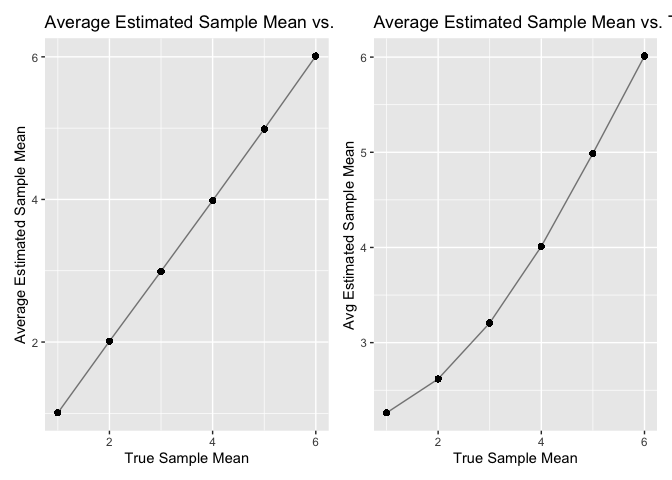

p8105_hw5_st3431
================
2022-11-16

## R Markdown

``` r
library(tidyverse)
```

    ## ── Attaching packages ─────────────────────────────────────── tidyverse 1.3.2 ──
    ## ✔ ggplot2 3.3.6      ✔ purrr   0.3.4 
    ## ✔ tibble  3.1.8      ✔ dplyr   1.0.10
    ## ✔ tidyr   1.2.0      ✔ stringr 1.4.1 
    ## ✔ readr   2.1.2      ✔ forcats 0.5.2 
    ## ── Conflicts ────────────────────────────────────────── tidyverse_conflicts() ──
    ## ✖ dplyr::filter() masks stats::filter()
    ## ✖ dplyr::lag()    masks stats::lag()

**Problem 2**

The raw data has variables such as the date of the crime, the victims
names, the location which the crime was occurring and the outcome of the
crime (whether it was solved or remained unsolved).

Importing and cleaning the dataset

``` r
crimes_df =
  read_csv("hw5_data/homicide-data.csv", na = c("", "Unknown")) %>%
  mutate(
    city_state = str_c(city, state),
    resolution = case_when(
      disposition == "Closed without arrest" ~ "unsolved",
      disposition == "Open/No arrest" ~ "unsolved",
      disposition == "Closed by arrest" ~ "solved")) %>% 
  relocate(city_state)  
```

    ## Rows: 52179 Columns: 12
    ## ── Column specification ────────────────────────────────────────────────────────
    ## Delimiter: ","
    ## chr (8): uid, victim_last, victim_first, victim_race, victim_sex, city, stat...
    ## dbl (4): reported_date, victim_age, lat, lon
    ## 
    ## ℹ Use `spec()` to retrieve the full column specification for this data.
    ## ℹ Specify the column types or set `show_col_types = FALSE` to quiet this message.

Unsolved homicides in Baltimore, MD

``` r
baltimore_df =
  crimes_df %>% 
  filter(city_state == "BaltimoreMD")

baltimore_crimes =
  baltimore_df %>% 
    summarize(
      unsolved = sum(resolution == "unsolved"),
      n = n())

baltimore_prop =
  prop.test(
    x = baltimore_crimes %>% pull(unsolved),
    n = baltimore_crimes %>% pull(n)) 

  broom::tidy(baltimore_prop) %>% 
  select(estimate, conf.low, conf.high) %>% 
  knitr::kable()
```

|  estimate |  conf.low | conf.high |
|----------:|----------:|----------:|
| 0.6455607 | 0.6275625 | 0.6631599 |

The estimated proportion of unsolved cases within Baltimore, Marlyand is
64.56% with a 95% confidence interval of (62.76%, 66.32%).

Unsolved cases across each city

``` r
prop_test_function = function(city_df) {
  city_totals =
    city_df %>% 
      summarize(
        unsolved = sum(resolution == "unsolved"),
        n = n())
    city_prop =
    prop.test(
      x = city_totals %>% pull(unsolved),
      n = city_totals %>% pull(n))
 return(city_prop) }

prop_test_function(baltimore_df)
```

    ## 
    ##  1-sample proportions test with continuity correction
    ## 
    ## data:  city_totals %>% pull(unsolved) out of city_totals %>% pull(n), null probability 0.5
    ## X-squared = 239.01, df = 1, p-value < 2.2e-16
    ## alternative hypothesis: true p is not equal to 0.5
    ## 95 percent confidence interval:
    ##  0.6275625 0.6631599
    ## sample estimates:
    ##         p 
    ## 0.6455607

``` r
all_cities=
  crimes_df %>% 
  nest(data = uid:resolution) %>%
  mutate(
    results = map(data, prop_test_function), 
    tidy_results= map(results, broom::tidy)
  ) %>%
  select(city_state, tidy_results) %>% 
  unnest(tidy_results) %>% 
  select(city_state, estimate, conf.low, conf.high) %>%  
  rename(low_conf= conf.low, high_conf= conf.high)
```

    ## Warning in prop.test(x = city_totals %>% pull(unsolved), n = city_totals %>% :
    ## Chi-squared approximation may be incorrect

Creating a plot showing estimates and CI’s for each city

``` r
all_cities %>%  
  mutate(city_state= fct_reorder(city_state, estimate)) %>%
  ggplot(aes(x= city_state, y= estimate)) + 
  geom_point() + 
  geom_errorbar(aes(ymin= low_conf, ymax= high_conf)) + 
  labs(title= "Estimates of Unsolved Cases in 50 U.S. Cities", 
       x= "City", 
       y= "Estimates of Unsolved Cases") +
  coord_flip()
```

<!-- -->

**Problem 3**

**Problem 3**

``` r
library(rvest)
```

    ## 
    ## Attaching package: 'rvest'

    ## The following object is masked from 'package:readr':
    ## 
    ##     guess_encoding

``` r
sample_df = map(1:5000, ~ rnorm(n = 30, mean = 0, sd = 5))

est_mean = function(n_obs = 30, mu, sigma = 5) {
  x = rnorm(n = n_obs, mean = mu, sd = sigma)
  tibble (mu_mean = mean(x),
    p_value = t.test(x, mu = 0)$p.value
  )
  
}

df_mu = 
  expand_grid(n = 30,
    mu = 0,
    sigma = 5,
    dataset = 1:5000) %>% 
  mutate( estimates_df = 
      map(.x = mu, ~est_mean(mu = .x))) %>% 
  unnest(estimates_df)

df_mu
```

    ## # A tibble: 5,000 × 6
    ##        n    mu sigma dataset mu_mean p_value
    ##    <dbl> <dbl> <dbl>   <int>   <dbl>   <dbl>
    ##  1    30     0     5       1 -0.652   0.491 
    ##  2    30     0     5       2  1.40    0.125 
    ##  3    30     0     5       3  0.209   0.831 
    ##  4    30     0     5       4  0.660   0.422 
    ##  5    30     0     5       5 -0.796   0.374 
    ##  6    30     0     5       6  0.629   0.503 
    ##  7    30     0     5       7 -0.886   0.229 
    ##  8    30     0     5       8 -0.0468  0.958 
    ##  9    30     0     5       9 -1.99    0.0273
    ## 10    30     0     5      10  0.109   0.919 
    ## # … with 4,990 more rows

``` r
all_mu = 
  expand_grid(
    n = 30,
    mu = c(1, 2, 3, 4, 5, 6), 
    sigma = 5,
    dataset = 1:5000) %>% 
  mutate(
    estimates_df = 
      map(.x = mu, ~est_mean(mu = .x))) %>% 
  unnest(estimates_df)

all_mu
```

    ## # A tibble: 30,000 × 6
    ##        n    mu sigma dataset mu_mean p_value
    ##    <dbl> <dbl> <dbl>   <int>   <dbl>   <dbl>
    ##  1    30     1     5       1   1.10  0.250  
    ##  2    30     1     5       2   0.459 0.593  
    ##  3    30     1     5       3   1.73  0.0493 
    ##  4    30     1     5       4   0.542 0.544  
    ##  5    30     1     5       5   0.280 0.731  
    ##  6    30     1     5       6   0.263 0.776  
    ##  7    30     1     5       7   1.24  0.104  
    ##  8    30     1     5       8   3.17  0.00673
    ##  9    30     1     5       9   0.904 0.313  
    ## 10    30     1     5      10   2.62  0.00714
    ## # … with 29,990 more rows

``` r
Plot_1 = 
  all_mu %>%
  group_by(mu) %>%
  summarise(
    null_reject = sum(p_value < 0.05),
    cnt = n()) %>%
  mutate(
    prop_null_reject = null_reject / cnt)  %>% 
  ggplot(aes(x = mu, y = prop_null_reject)) + 
  geom_point(alpha=0.5) + 
  geom_line(alpha=0.5) +
  labs(
    title = "Null Hypothesis Rejection Proportion by Sample Mean",
    x = "True Sample Mean Value",
    y = "Null Hypothesis Rejection Proportion")

Plot_1
```

<!-- -->

The relationship between the true sample mean and the power is a
positive one. As the true sample mean increases the power increases and
as the sample mean reaches 5 the power hits 1. We can then conclude that
large effect sizes increase statistical power.

``` r
library(patchwork)
Plot_2a= 
  all_mu %>%
  group_by(mu) %>%
  mutate(avg_mu = mean(mu_mean)) %>%
  ggplot(aes(x = mu, y = avg_mu)) +
  geom_point() + 
  geom_line(alpha= .5) +
  labs(
    title = "Average Estimated Sample Mean vs. True Sample Mean",
    x = "True Sample Mean",
    y = "Average Estimated Sample Mean")

Plot_2a
```

<!-- -->

``` r
Plot_2b= 
 all_mu %>%
  filter(p_value < 0.05) %>%
  group_by(mu) %>%
  mutate(avg_mu = mean(mu_mean)) %>%
  ggplot(aes(x = mu, y = avg_mu)) +
  geom_point() + 
  geom_line(alpha= 0.5) + 
  labs(
    title = "Average Estimated Sample Mean vs. True Sample Mean in Rejected Samples",
    x = "True Sample Mean",
    y = "Avg Estimated Sample Mean")

Plot_2b
```

<!-- -->

``` r
Plot_2a + Plot_2b
```

<!-- -->

Comparing the two plots we can see that the true sample mean is
approximately equal to the average sample mean when we include all of
the samples. However when we only include the sample that is rejected in
plot 2b, there are fewer values that align with the true value.
